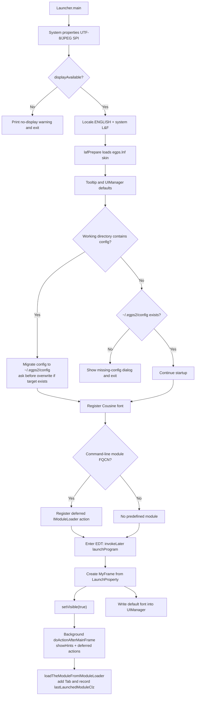

# Understanding How `egps-shell` Launches

This document explains the startup flow of `egps-shell`, and points back to the entry classes in the current `egps-main` implementation. It is intended to help with understanding the real runtime path, local debugging, and problem tracing.

The current entry classes are mainly:

- `egps2.Launcher`: standard launcher
- `egps2.Launcher4Dev`: development launcher that sets `Launcher.isDev = true` before entering `Launcher.main`

## Entry Points and Common Commands

- Standard entry: `egps2.Launcher` (`src/egps2/Launcher.java`)  
  Command: `java -cp "./out/production/egps-main.gui:dependency-egps/*" -Xmx12g @eGPS.args egps2.Launcher`
- Development entry: `egps2.Launcher4Dev` (`src/egps2/Launcher4Dev.java`)  
  Command: `java -cp "./out/production/egps-main.gui:dependency-egps/*" -Xmx12g @eGPS.args egps2.Launcher4Dev`
- Launching a predefined module by passing a loader FQCN  
  Command: `java -cp "./out/production/egps-main.gui:dependency-egps/*" -Xmx12g @eGPS.args egps2.Launcher egps2.builtin.modules.voice.IndependentModuleLoader`
- Compilation (JDK 25): `javac -d ./out/production/egps-main.gui -cp "dependency-egps/*" $(find src -name "*.java")`

Notes:

- `@eGPS.args` contains the `--add-exports` and `--add-opens` flags needed by the current Java runtime setup and should normally be kept in launch commands.
- On Windows, replace the classpath separator `:` with `;`.

## Startup Sequence (`Launcher.main`)

1. **System properties and display check**: sets `file.encoding=UTF-8`, registers JPEG writer SPI, and calls `displayAvailable()` through `GraphicsEnvironment`. If no display is available, the program prints a warning to stderr and exits.
2. **Locale and look-and-feel setup**: forces `Locale.ENGLISH`, applies the system LookAndFeel, and calls `lafPrepare()` to assemble the `egps.lnf.*` custom UI skin. On macOS, extra system-menu and directory-selection flags are also enabled.
3. **Tooltip and other UI defaults**: extends tooltip timing and prepares global `UIManager` values.
4. **Config-directory detection and first launch handling**:
   - if a `config/` directory exists in the working directory, the current implementation treats it as a shipped seed-config source
   - on first launch, `AutoConfigThePropertiesAction` migrates that `config/` directory into `~/.egps2/config` (`EGPSProperties.PROPERTIES_DIR`) and creates required subdirectories such as `jsonData`
   - if the user config directory already exists, the program asks whether it should be overwritten
   - if there is no `config/` directory in the working directory, then `~/.egps2/config` must already exist or the program exits with a missing-config prompt
   - as a result, `config/` acts as an installation-time seed, while `~/.egps2/config` is the long-term runtime config directory
5. **Font registration**: loads and registers `CustomizeFontEnum.COUSINEREGULARFONTFAMILY`.
6. **Pre-registering a module to load**: if a loader FQCN is passed from the command line, `UnifiedAccessPoint.registerActionAfterMainFrame` stores a deferred action so that the module is loaded after the main frame becomes visible.
7. **Entering the EDT**: `SwingUtilities.invokeLater` calls `launchProgram()` so later UI operations run on the EDT.

## Main Window Creation and Global State (`launchProgram` / `UnifiedAccessPoint`)

- `UnifiedAccessPoint.getInstanceFrame()` lazily creates `MyFrame`, with size and position coming from `LaunchProperty`
- `LaunchProperty` first reads `~/.egps2/config/jsonData/defaultGlobalProperties.json`; if that file does not exist, it uses defaults; if the saved window position is invalid, it falls back to default geometry
- after the window is visible, a background thread calls `UnifiedAccessPoint.doActionAfterMainFrame()`: first `MyFrame.showHints()`, then all deferred actions in order, including command-line module loading
- `launchProgram()` writes `UnifiedAccessPoint.getLaunchProperty().getDefaultFont()` into `UIManager` so components such as ToolTip, OptionPane, and TextField share a unified default font
- `UnifiedAccessPoint.isGULaunched()` depends on whether `MyFrame` already exists, and can be used by command-line logic or plugins to check GUI state

## Preloaded Modules and the Unified Entry

- if a loader class name is provided from the command line, `loadThePredefinedModule` instantiates the target `IModuleLoader` through reflection
- `UnifiedAccessPoint.loadTheModuleFromIModuleLoader` then performs the actual loading
- this unified entry reads the tab name, description, and icon from `IModuleLoader`, converts it to a `ModuleFace`, adds it to the main-frame tabs, and records the last launched module class name in `LaunchProperty`

## Related Implementation Files and Troubleshooting Hints

- startup core: `src/egps2/Launcher.java`, `src/egps2/Launcher4Dev.java`, `src/egps2/UnifiedAccessPoint.java`
- configuration bootstrap: `src/egps2/frame/features/AutoConfigThePropertiesAction.java`, `src/egps2/EGPSProperties.java`
- property persistence: `src/egps2/LaunchProperty.java` (writes to `~/.egps2/config/jsonData/defaultGlobalProperties.json`)

Common problems:

- no display environment: verify that `DISPLAY` is valid, or enable WSLg when launching from WSL
- missing config: if `~/.egps2/config` was deleted by mistake, restore the shipped `config/` directory and launch again, or reinstall
- newly added module does not preload: make sure the target `IModuleLoader` is on the classpath and pass its FQCN to `Launcher`
