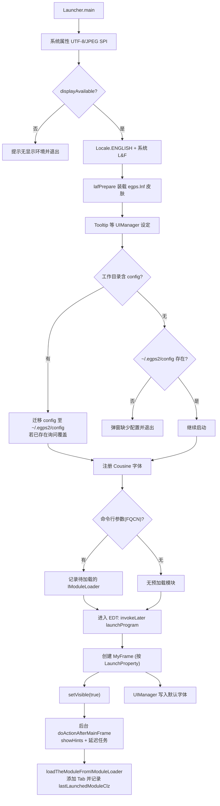

# egps-shell 启动流程解读

这篇文档说明 `egps-shell` 的启动流程，以及这些行为在当前 `egps-main` 中由哪些入口类实现，便于理解真实运行路径、本地调试和问题排查。

当前实现入口主要是：

- `egps2.Launcher`：标准启动入口
- `egps2.Launcher4Dev`：开发模式启动入口，在进入 `Launcher.main` 前将 `Launcher.isDev = true`

## 运行入口与常用命令

- 标准启动入口：`egps2.Launcher`（`src/egps2/Launcher.java`）  
  运行命令：`java -cp "./out/production/egps-main.gui:dependency-egps/*" -Xmx12g @eGPS.args egps2.Launcher`
- 开发模式入口：`egps2.Launcher4Dev`（`src/egps2/Launcher4Dev.java`）  
  运行命令：`java -cp "./out/production/egps-main.gui:dependency-egps/*" -Xmx12g @eGPS.args egps2.Launcher4Dev`
- 指定启动模块（传入模块加载器 FQCN，启动后自动打开模块标签页）  
  运行命令：`java -cp "./out/production/egps-main.gui:dependency-egps/*" -Xmx12g @eGPS.args egps2.Launcher egps2.builtin.modules.voice.IndependentModuleLoader`
- 编译（JDK 25）：`javac -d ./out/production/egps-main.gui -cp "dependency-egps/*" $(find src -name "*.java")`

说明：

- `@eGPS.args` 中包含当前 Java 运行环境需要的 `--add-exports` 和 `--add-opens` 参数，日常启动建议一并带上。
- 在 Windows 下，classpath 分隔符应从 `:` 改为 `;`。

## 启动时序（`Launcher.main`）

1. **系统属性与显示环境**：设置 `file.encoding=UTF-8`、JPEG Writer SPI；调用 `displayAvailable()` 通过 `GraphicsEnvironment` 检查图形环境，若无可用显示环境，则在 stderr 提示后退出。
2. **语言与 L&F**：强制 `Locale.ENGLISH`，应用系统 LookAndFeel，并调用 `lafPrepare()` 装配 `egps.lnf.*` 自定义界面皮肤；在 macOS 上额外启用系统菜单栏与目录选择相关设置。
3. **Tooltip 与其他 UI 默认值**：扩展 Tooltip 显示时长与延迟时间，准备全局 `UIManager` 参数。
4. **配置目录探测与首次启动**：
   - 如果工作目录中存在 `config/`，当前实现会把它视为分发包附带的初始配置来源。
   - 首次启动时，`AutoConfigThePropertiesAction` 会将这份 `config/` 迁移到用户目录 `~/.egps2/config`（`EGPSProperties.PROPERTIES_DIR`），并创建 `jsonData` 等所需子目录。
   - 如果用户目录中已经存在配置，程序会弹窗询问是否覆盖；如果选择不覆盖，则继续使用用户目录下已有配置。
   - 如果工作目录中没有 `config/`，则程序要求 `~/.egps2/config` 已存在；否则会提示配置缺失并退出。
   - 因此，`config/` 更像首次安装时的“种子配置”，而真正长期生效的运行时配置目录是 `~/.egps2/config`。
5. **字体注册**：通过 `CustomizeFontEnum.COUSINEREGULARFONTFAMILY` 读取并注册字体，保证 Swing 组件可用。
6. **预注册待加载模块**：若命令行传入模块加载器 FQCN，则通过 `UnifiedAccessPoint.registerActionAfterMainFrame` 记录延迟任务，等主窗体可见后再加载。
7. **进入 EDT**：使用 `SwingUtilities.invokeLater` 调用 `launchProgram()`，保证后续 UI 操作在 EDT 中执行。

## 主窗体创建与全局状态（`launchProgram` / `UnifiedAccessPoint`）

- `UnifiedAccessPoint.getInstanceFrame()` 会懒加载创建 `MyFrame`，窗口尺寸和位置来自 `LaunchProperty`。
- `LaunchProperty` 优先读取 `~/.egps2/config/jsonData/defaultGlobalProperties.json`；如果不存在则使用默认值；如果检测到窗口位置异常，也会回退到默认窗口参数。
- 窗口显示后，后台线程触发 `UnifiedAccessPoint.doActionAfterMainFrame()`：先执行 `MyFrame.showHints()`，再按顺序运行所有延迟任务，包括命令行传入的模块加载器。
- `launchProgram()` 会把 `UnifiedAccessPoint.getLaunchProperty().getDefaultFont()` 写入 `UIManager`，统一 Tooltip、OptionPane、TextField 等组件的默认字体。
- `UnifiedAccessPoint.isGULaunched()` 依赖 `MyFrame` 是否已经创建，可供命令行逻辑或插件判断 GUI 状态。

## 模块预加载与统一入口

- 如果命令行提供了模块加载器类名，`loadThePredefinedModule` 会通过反射实例化对应的 `IModuleLoader`。
- 随后由 `UnifiedAccessPoint.loadTheModuleFromIModuleLoader` 执行统一加载。
- 这个统一入口会从 `IModuleLoader` 读取标签名、描述和图标，将其转换为 `ModuleFace` 并添加到主框架 Tab，同时记录最近一次启动的模块类名到 `LaunchProperty`。

## 关联实现文件与排错提示

- 启动核心：`src/egps2/Launcher.java`、`src/egps2/Launcher4Dev.java`、`src/egps2/UnifiedAccessPoint.java`
- 配置初始化：`src/egps2/frame/features/AutoConfigThePropertiesAction.java`、`src/egps2/EGPSProperties.java`
- 属性持久化：`src/egps2/LaunchProperty.java`（写入 `~/.egps2/config/jsonData/defaultGlobalProperties.json`）

常见问题：

- 无显示环境：确认 `DISPLAY` 有效，或在 WSL 中启用 WSLg 后再启动。
- 配置缺失：若误删 `~/.egps2/config`，可重新提供分发包中的 `config/` 后启动，或重新安装。
- 新增模块无法预加载：确认对应 `IModuleLoader` 已进入 classpath，并将其 FQCN 作为 `Launcher` 的命令行参数传入。
