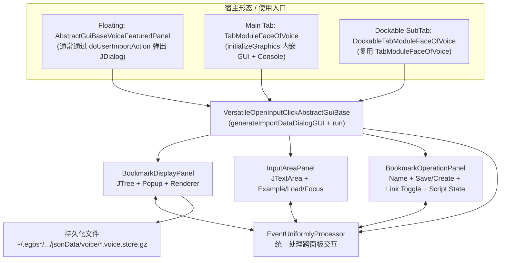
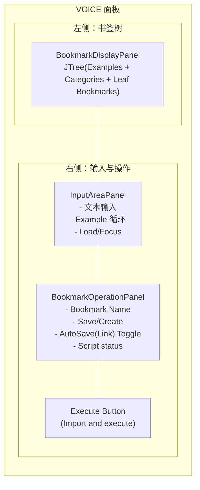
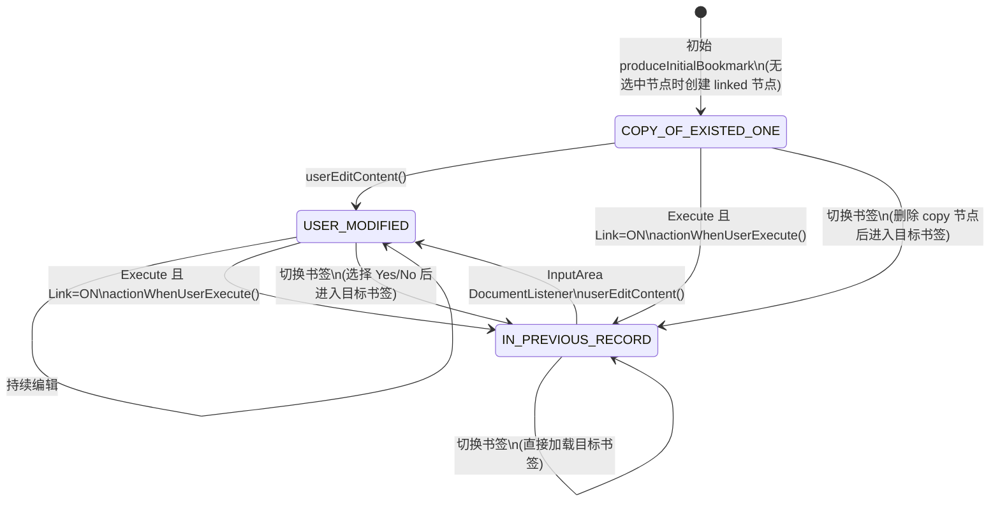
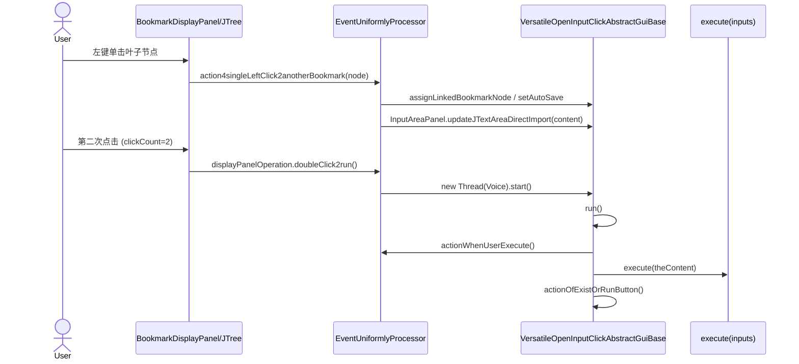
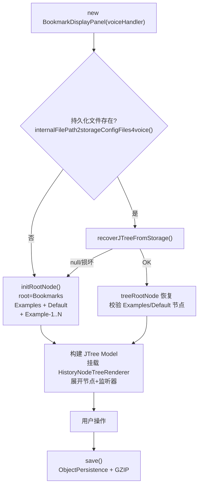
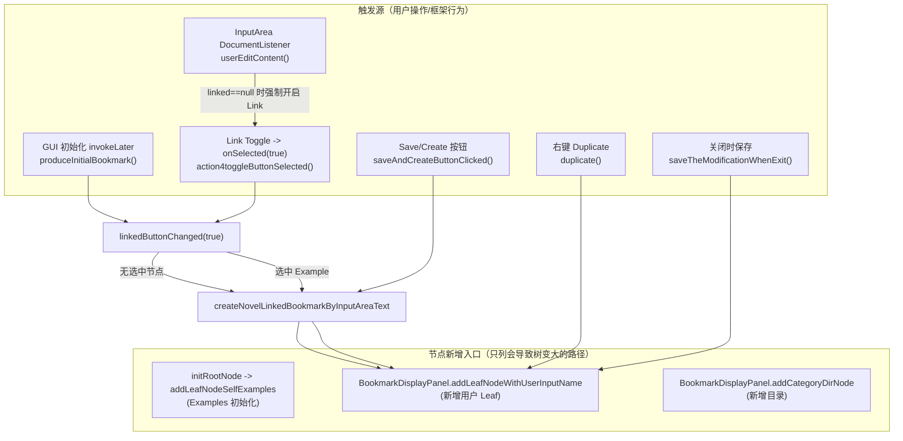
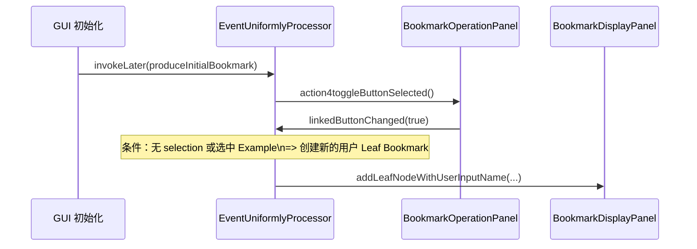
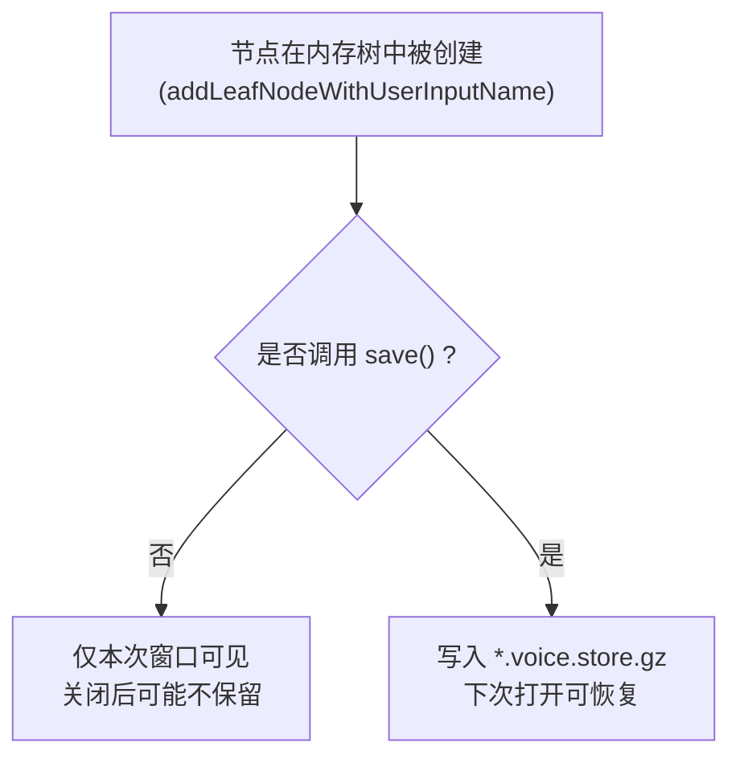

# 02. VOICE GUI 设计梳理（现状）

本文档聚焦 **VOICE 的 GUI 侧实现**：以 `AbstractGuiBaseVoiceFeaturedPanel` 为典型入口，梳理其背后共用的 GUI 基类 `VersatileOpenInputClickAbstractGuiBase` 及其三个子面板（Bookmark / Input / Operation）的现有设计与执行逻辑。

- 关联文档：`manuals/01_VOICE_architecture.md`（VOICE 分层与三种集成形态的概览）
- 目标：把“现在到底怎么跑起来、事件怎么串起来、状态怎么变化”讲清楚，尤其是 **书签树节点如何被创建/绑定/持久化** 的机制。

---

## 1. 入口类与“宿主形态”

VOICE 的 GUI 核心并不只在 `AbstractGuiBaseVoiceFeaturedPanel` 本身，而是复用同一套 GUI 基类：

- **GUI 基类（核心）**：`egps2.builtin.modules.voice.VersatileOpenInputClickAbstractGuiBase`
  - 负责：拼装 GUI、统一事件调度、运行线程（`Runnable`）、对话框生命周期、书签持久化路径等。
- **浮动窗快捷封装**：`egps2.builtin.modules.voice.template.AbstractGuiBaseVoiceFeaturedPanel`
  - 负责：把 “参数声明 + 示例生成 + 参数解析 + execute(OrganizedParameterGetter)” 进一步封装。
- **主窗口 Tab 形态封装**：`egps2.builtin.modules.voice.fastmodvoice.TabModuleFaceOfVoice`
  - 内部创建 `VoiceParameterHandler4DIYTabModuleFace`（继承 GUI 基类）来复用同一套输入/书签界面，并在底部再包一层 Console。

---

## 2. GUI 布局（现状）

GUI 由 `VersatileOpenInputClickAbstractGuiBase.generateImportDataDialogGUI()` 组装，结构固定：

---

## 3. 关键对象与职责（按文件）

### 3.1 GUI 基类：`VersatileOpenInputClickAbstractGuiBase`

核心职责：

1) **拼装界面**：创建 `BookmarkDisplayPanel / InputAreaPanel / BookmarkOperationPanel`，并在最后创建 `EventUniformlyProcessor`。  
2) **生命周期**：
   - `doUserImportAction()`：弹出 `JDialog`（并用 `alreadyHasOneImportDialog` 防止重复打开）。
   - `actionOfExistOrRunButton()`：保存对话框位置、关闭对话框、重置 “已经打开过” 标志。
3) **执行入口**：实现 `Runnable#run()`，在后台线程执行：
   - `actionWhenUserExecute()`（保存/同步 bookmark 等 UI 状态）
   - `execute(inputs)`（抽象方法，由子类实现业务执行）
4) **持久化路径**：`internalFilePath2storageConfigFiles4voice()` → `EGPSProperties.JSON_DIR/voice/<getFile4storage()>.voice.store.gz`
   - `getFile4storage()` 默认用 `getClass().getName()`，可覆写以隔离不同模块/宿主的书签空间。

### 3.2 三个子面板

- `BookmarkDisplayPanel`
  - `JTree` 展示：`Examples`（只读示例）+ 默认目录 + 用户目录/书签叶子。
  - 右键菜单：Flag / Duplicate / Rename / Delete / Export / Import All / Export All / Add directory 等。
  - 鼠标事件：
    - **左键单击叶子**：加载该 bookmark 到输入框（通过 `EventUniformlyProcessor.action4singleLeftClick2anotherBookmark`）。
    - **双击叶子**：直接触发执行（`doubleClick2run()` → `new Thread(voiceHandler).start()`）。
  - `save()`：把整棵树（`DefaultMutableTreeNode treeRootNode`）GZIP 序列化到持久化文件。

- `InputAreaPanel`
  - `JTextArea` + DocumentListener：用户编辑时通知 `EventUniformlyProcessor.userEditContent()`。
  - `Example` 按钮：循环切换示例（实质是让书签树选中某个 Example leaf，再走同一套“选中书签”逻辑）。
  - `updateJTextAreaDirectImport()`：**会临时移除 DocumentListener**，避免程序性 setText 被误判为 “用户编辑”。

- `BookmarkOperationPanel`
  - Bookmark 名称输入框 + DocumentListener：在 **Link Toggle 选中** 时，名称变更会同步到 `linkedBookMarkNode.name`。
  - `Save/Create` 按钮：
    - linked 关闭：保存脚本到新节点（不产生新的 linked 节点）
    - linked 开启：保存当前 linked 节点内容，并创建一个新的 linked 节点（用于继续编辑）
  - Link Toggle（checkboxAutoSaveBookmark）：
    - 选中：触发 `linkedButtonChanged(true)`，保证输入区与某个 bookmark 节点绑定。
    - 取消：触发 `linkedButtonChanged(false)`，并在某些状态下删除临时复制节点。
  - Script state：`EditScriptState`（见下一节）用只读下拉框显示。

### 3.3 统一事件调度：`EventUniformlyProcessor`

它不是“所有事件都在这里处理”，而是只放 **需要跨面板协作** 的逻辑（例如：切换书签时要考虑输入区是否修改、Link 状态、是否删除临时节点等）。

内部拆成三组动作（概念上）：

- `BookmarkDisplayPanelActions`：导入/导出/复制/双击执行等
- `BookmarkOperationPanelActions`：名称变化、Save&Create、Link Toggle 变化
- `InputDataAreaPanelActions`：输入区编辑、跳转 Examples

---

## 4. 两个“核心状态”：linked bookmark + EditScriptState

### 4.1 `linkedBookMarkNode`（输入区绑定的 bookmark）

`VersatileOpenInputClickAbstractGuiBase` 维护一个 `linkedBookMarkNode`：

- **意义**：当 Link Toggle 开启时，输入区的内容会在合适时机（执行/保存/退出）同步回这个节点；同时树渲染器会高亮它。
- **渲染**：`HistoryNodeTreeRenderer` 会对 `bookMarkNode == voiceImportHandler.getLinkedBookMarkNode()` 的节点加虚线边框并显示 editing icon。

### 4.2 `EditScriptState`（输入脚本状态机）

枚举：`IN_PREVIOUS_RECORD / COPY_OF_EXISTED_ONE / USER_MODIFIED`

主要用途：在“切换书签 / 取消绑定 / 执行”时决定是否要：
- 覆盖旧节点内容
- 删除临时复制节点
- 把状态回收为 IN_PREVIOUS_RECORD

> 注：当 Link Toggle 关闭时，`actionWhenUserExecute()` 会提前 return，不会推进状态。

---

## 5. 典型交互时序（重要）

### 5.1 单击 bookmark：加载脚本到输入区

核心调用链：

- `BookmarkDisplayPanel.DisplayMouseAdapter.mouseClicked(clickCount=1)`  
  → `EventUniformlyProcessor.action4singleLeftClick2anotherBookmark(target)`
  - 可能触发确认弹窗（当前输入区为 USER_MODIFIED）
  - 对 Example 节点：关闭 Link（不可绑定到 Example）
  - 对普通节点：开启 Link，并将其设为 `linkedBookMarkNode`
  - `InputAreaPanel.updateJTextAreaDirectImport(content)`（不会触发 userEditContent）

### 5.2 双击 bookmark：触发执行（等价于点击 Execute）

核心点：双击会直接 `new Thread(voiceHandler).start()`。

### 5.3 Execute 按钮点击：同样触发执行，但带 1.2s 防抖

`VersatileOpenInputClickAbstractGuiBase.generateImportDataDialogGUI()` 中对按钮做了简单节流：

- 两次点击间隔 `< 1200ms` 会弹窗提示 “Are you a robot?”
- 然后 `new Thread(this).start()`

> 对比：Bookmark 双击执行的路径 **不走这个节流**（这是后续排查 “频繁触发导致异常” 时需要关注的点之一）。

---

## 6. 书签树的持久化与初始化

### 6.1 初始化流程（BookmarkDisplayPanel 构造）

### 6.2 持久化文件路径

- 文件名：`<getFile4storage()>.voice.store.gz`
- 默认：`getFile4storage()` → `getClass().getName()`
- 目录：`EGPSProperties.JSON_DIR/voice/`

这意味着：同一个 VOICE GUI 只要类名不同，就会自动拥有独立的 bookmark 存储空间；也可以通过覆写 `getFile4storage()` 在同一个类里按宿主/场景进一步隔离。

---

## 7. 自动创建书签与持久化机制（现状）

这一节只描述 **现有机制如何运作**：什么时候会“自动创建”一个书签节点，什么时候会把树状态落盘。

两个核心点：

- **创建节点**：来自若干个明确入口（`addLeafNodeWithUserInputName` / `addCategoryDirNode` / examples 初始化）。
- **持久化落盘**：`BookmarkDisplayPanel.save()` 会把“当前整棵树”写入 `*.voice.store.gz`，之后再次打开就能看到同样的树。

### 7.1 书签树新增节点的入口（代码层面）

在 VOICE 当前实现里，树节点的新增主要集中在以下入口：

1) **初始化 Examples**
   - `BookmarkDisplayPanel.initRootNode()` → `addLeafNodeSelfExamples(...)`
   - 只在“首次无持久化文件 / 持久化损坏需重建”时发生。

2) **新增用户 Leaf Bookmark**
   - 唯一新增方法：`BookmarkDisplayPanel.addLeafNodeWithUserInputName(name, value)`
   - 典型调用者：
     - `EventUniformlyProcessor.createNovelLinkedBookmarkByInputAreaText(...)`
     - `EventUniformlyProcessor.BookmarkOperationPanelActions.saveAndCreateButtonClicked(...)`
     - `EventUniformlyProcessor.BookmarkDisplayPanelActions.duplicate(...)`
     - `EventUniformlyProcessor.saveTheModificationWhenExit(...)`（关闭时保存）

3) **新增目录节点**
   - `BookmarkDisplayPanel.addCategoryDirNode(name)`（右键菜单 Add directory）

> 关键点：**`linkedButtonChanged(true)` 在 “无选中节点” 或 “选中的是 Example” 时，会走 `createNovelLinkedBookmarkByInputAreaText(...)` 从而新增一个用户 Leaf 节点。**

### 7.2 “自动创建 linked 书签”的时机与条件（最常见路径）

在浮动窗（`JDialog`）场景中，`generateImportDataDialogGUI()` 创建完三个面板后，会 `invokeLater(produceInitialBookmark())`。这一段通常会导致“自动创建/绑定”发生：

1) 框架调用 `produceInitialBookmark()`  
2) 它会触发 `BookmarkOperationPanel.action4toggleButtonSelected()`  
3) 进而进入 `EventUniformlyProcessor.BookmarkOperationPanelActions.linkedButtonChanged(true)`  
4) `linkedButtonChanged(true)` 会读取 “当前书签树 selection”：
   - **selection 为空**：创建一个新的用户 Leaf Bookmark，并把它设为 linked（用于绑定输入区）
   - **selection 是 Example leaf**：同样会创建一个新的用户 Leaf Bookmark（因为 Example 不允许成为 linked）
   - **selection 是普通用户 leaf**：直接把该 leaf 设为 linked（不创建新节点）

### 7.3 执行/双击与 “save() 持久化” 的关系

无论是点击 Execute，还是在书签树上双击触发执行，最终都会进入 `voiceHandler.run()`，并在 `actionWhenUserExecute()` 里调用一次 `bookmarkDisplayPanel.save()`：

- 如果在执行前已经通过上述机制新增了节点，那么这次 `save()` 会把它写入持久化文件，导致“下次打开也能看到该节点”。
- 如果只是在内存里新增了节点但没有触发 `save()`，那么它可能不会在下次打开时出现（取决于你是否在其它动作里触发过 `save()`）。

