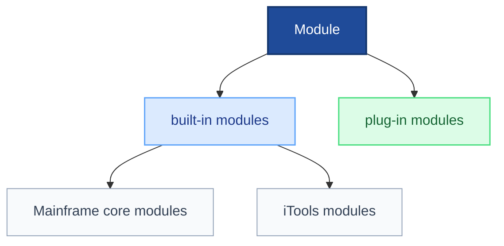

# eGPS Module and Plugin Development Course

> Welcome to the eGPS module-development course.  
> This tutorial set helps you learn how to build custom modules and plugins for eGPS, from the quickest path to a deeper architectural understanding.

## Module definition (developer view)

- Any class implementing `IModuleSignature` is considered a module. Since `IModuleLoader` extends `IModuleSignature`, GUI loaders are modules too. A module can be a command-line (CLI) module or a graphical (GUI) module.
- GUI modules currently fall into three groups: **Mainframe core modules**, **iTools / independent tools**, and **plug-in modules** shipped as external JARs. In simpler terms, modules are divided into built-in and plug-in deployment types.
- `ModuleInspector` can track all three groups; Module Gallery shows the current active loader set among them.
- Menu mapping is currently: Mainframe core menu for core modules, iTools menu for independent tools, and Plugins menu for plugin modules.



---

## Course map

### 01. Quick Start

Best for developers who want to create a first module quickly.

Main outcomes:

- create a first module in minutes
- use the automation script to generate example plugins
- understand Plug-in vs Built-in deployment
- install and test a plugin

### 02. Plugin Development (Plugin mode)

Best for developers who want to ship external extensions.

Main topics:

- two plugin-development styles
- `FastBaseTemplate` for simpler plugins
- direct `IModuleLoader` implementation for more complex plugins
- packaging, installation, and testing

### 03. Built-in Development (Built-in mode)

Best for developers who want modules to ship with the application.

Main topics:

- relation between Built-in and Plug-in deployment
- when the same module code can be reused
- runtime differences between the two deployment modes
- practical conversion between them

### 04. Architecture

Best for readers who want a deeper technical understanding.

Main topics:

- module-system architecture
- `IModuleLoader` contract
- `ModuleFace` base class
- `FastBaseTemplate`
- module discovery and runtime loading

### 05. `eGPS2.plugin.properties`

Best for plugin authors.

Main topics:

- real loading fields currently used by the plugin loader
- format of `launchClass`
- use of `dependentJars`
- common mistakes and validation ideas

---

## Automation tool

### `create-all-test-plugins.sh`

This script generates several example plugins so developers can inspect working examples instead of starting from a blank directory.

Typical workflow:

```bash
cd /path/to/egps-main.gui
bash docs/module_plugin_course/create-all-test-plugins.sh
```

---

## Suggested learning paths

### Path 1: fastest start

1. `01_QUICK_START.md`
2. `02_PLUGIN_DEVELOPMENT.md`

### Path 2: full understanding

1. `01_QUICK_START.md`
2. `02_PLUGIN_DEVELOPMENT.md`
3. `03_BUILTIN_DEVELOPMENT.md`
4. `04_ARCHITECTURE.md`
5. `05_eGPS2.plugin.properties.md`

### Path 3: practical on-demand route

Pick the tutorial that matches the deployment mode or question you currently care about.

---

## Core concept snapshot

### Plugin mode vs Built-in mode

- both can reuse the same module code and interface
- they differ in deployment location, runtime path, loader behavior, and presentation
- “discovered” does not mean “currently active”
- Module Gallery follows the current active loader set
- plugin-mode modules can show a `[Plug]` badge when active

### Two development styles

1. extend `FastBaseTemplate`
2. implement `IModuleLoader` directly

The first is faster for simple tools. The second is better when you need stronger control over structure and lifecycle.

---

## Example projects

The generated example plugins typically include:

- a simple `FastBaseTemplate`-based plugin
- a direct `IModuleLoader` plugin
- more practical examples with documentation or utility behavior

Built-in examples can be studied directly under `src/egps2/builtin/modules/`.

---

## Recommended tools

- Java IDE such as IntelliJ IDEA
- shell scripting for packaging and repetitive testing
- direct source reading in the current repository for real examples

---

## Related documents

### Core reference docs

- `docs/module&pluginSystem/`
- `manuals/01_VOICE_architecture.md`
- `manuals/02_VOICE_GUI_design.md`
- `docs/class_reference_and_usage/`

### Source references

- `src/egps2/modulei/IModuleLoader.java`
- `src/egps2/frame/ModuleFace.java`
- `src/egps2/plugin/fastmodtem/FastBaseTemplate.java`
- `src/egps2/frame/features/ModuleDiscoveryService.java`
- `src/egps2/plugin/manager/PluginProperty.java`
- `src/egps2/plugin/manager/PluginOperation.java`

---

## Getting help

If a plugin does not appear or does not load correctly:

- check the runtime console output
- verify the plugin directory and config file
- confirm the loader class name
- compare the plugin against the generated examples

---

## Start here

If you want the shortest path, begin with `01_QUICK_START.md`.
