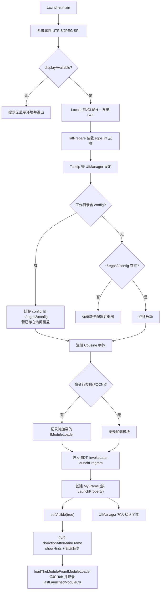

# eGPS 主程序启动流程解读
从入口类到主窗体显示的关键步骤梳理，便于本地调试和问题排查。

## 运行入口与常用命令
- 标准启动入口：`egps2.Launcher`（`src/egps2/Launcher.java`）。  
  运行命令：`java -cp "./out/production/egps-main.gui:dependency-egps/*" egps2.Launcher`
- 开发模式入口：`egps2.Launcher4Dev`（`src/egps2/Launcher4Dev.java`），仅在进入 `Launcher.main` 前将 `Launcher.isDev=true`。  
  运行命令：`java -cp "./out/production/egps-main.gui:dependency-egps/*" egps2.Launcher4Dev`
- 编译（JDK 25）：`javac -d ./out/production/egps-main.gui -cp "dependency-egps/*" $(find src -name "*.java")`
- 指定启动模块（传入模块加载器 FQCN，启动后自动打开模块标签页）：  
  `java -cp "./out/production/egps-main.gui:dependency-egps/*" egps2.Launcher egps2.builtin.modules.voice.IndependentModuleLoader`

## 启动时序（`Launcher.main`）

1. **系统属性与显示环境**：设置 `file.encoding=UTF-8`、JPEG Writer SPI；调用 `displayAvailable()` 通过 `GraphicsEnvironment` 检查图形环境，若无可用显示（例如 WSL 未启动 X server），直接在 stderr 提示并退出。
2. **语言与 L&F**：强制 `Locale.ENGLISH`，套用系统 LookAndFeel 并调用 `lafPrepare()` 装配自定义 UI 皮肤（`egps.lnf.*` 系列），包括 TabbedPane/Scroll/Slider/Menu 等调色与 Insets；在 macOS 上额外启用系统菜单栏与目录选择设置。
3. **Tooltip 与其他 UI 默认值**：扩展 Tooltip 显示/延迟时间，准备全局 UIManager 配色参数。
4. **配置目录探测与首次启动**：  
   - 分发包内若存在 `config/`（相对工作目录），视为“首次启动”。`AutoConfigThePropertiesAction` 会把该目录搬到用户目录 `~/.egps2/config`（`EGPSProperties.PROPERTIES_DIR`），并创建 `~/.egps2/config/jsonData` 等子目录。若用户目录已存在配置，会弹窗询问是否重置（Yes 覆盖，No 保留本地配置）。  
   - 若工作目录无 `config/`，视为非首次启动，此时要求 `~/.egps2/config` 已存在，否则弹出错误提示引导重新安装。
5. **字体注册**：通过 `CustomizeFontEnum.COUSINEREGULARFONTFAMILY` 读取并向 `GraphicsEnvironment` 注册字体，保证在各 Swing 组件可用。
6. **预注册待加载模块**：若命令行传入参数（模块加载器 FQCN），以 `UnifiedAccessPoint.registerActionAfterMainFrame` 记录延迟任务，等主窗体可见后按顺序加载。
7. **进入 EDT**：使用 `SwingUtilities.invokeLater` 调用 `launchProgram()`，所有后续 UI 操作在 EDT 进行。

## 主窗体创建与全局状态（`launchProgram` / `UnifiedAccessPoint`）
- `UnifiedAccessPoint.getInstanceFrame()` 懒加载创建 `MyFrame`（主窗口），尺寸和位置来自 `LaunchProperty`。`LaunchProperty` 优先读取 `~/.egps2/config/jsonData/defaultGlobalProperties.json`（若存在，包含窗口大小、字体、图标尺寸、模块使用次数等），否则使用默认值；若检测到窗口位置异常（坐标绝对值 > 18000），会恢复默认位置与尺寸。
- 窗口显示后，后台线程触发 `UnifiedAccessPoint.doActionAfterMainFrame()`：先执行 `MyFrame.showHints()`，再按顺序运行所有延迟任务（包括命令行传入的模块加载器）。
- 全局字体：`launchProgram` 将 `UnifiedAccessPoint.getLaunchProperty().getDefaultFont()` 写入 `UIManager`，统一 Tooltip/OptionPane/TextField 的字体。
- 运行态标记：`UnifiedAccessPoint.isGULaunched()` 依赖 `MyFrame` 是否已创建，可供命令行/插件判断 GUI 状态。

## 模块预加载与统一入口
- 预加载流程（命令行参数）：`loadThePredefinedModule` 通过反射实例化传入的 `IModuleLoader`，随后调用 `UnifiedAccessPoint.loadTheModuleFromIModuleLoader`。  
- 统一加载入口作用：从 `IModuleLoader` 读取标签名、描述、图标，转换为 `ModuleFace` 并添加到主框架 Tab，记录最近一次启动的模块类名到 `LaunchProperty` 以便下次恢复。

## 关联文件与排错提示
- 启动核心：`src/egps2/Launcher.java`、`src/egps2/Launcher4Dev.java`、`src/egps2/UnifiedAccessPoint.java`
- 配置初始化：`src/egps2/frame/features/AutoConfigThePropertiesAction.java`、`src/egps2/EGPSProperties.java`
- 属性持久化：`src/egps2/LaunchProperty.java`（写入 `~/.egps2/config/jsonData/defaultGlobalProperties.json`）
- 常见问题：  
  - 无显示（WSL/服务器）：确保 `DISPLAY` 有效或启用 WSLg，再启动。  
  - 配置缺失：若误删 `~/.egps2/config`，重新放置分发包内的 `config/` 后启动，或重新安装。  
  - 新增模块：保证对应 `IModuleLoader` 在 classpath 中，并用其 FQCN 作为 `Launcher` 命令行参数。
